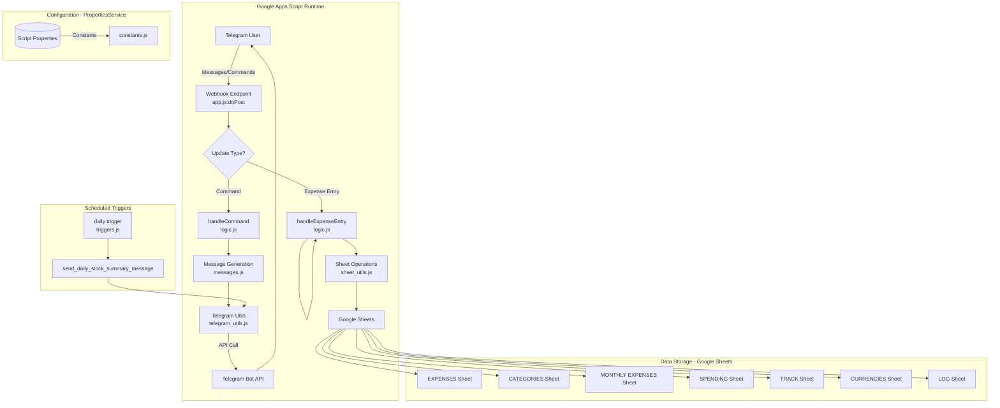
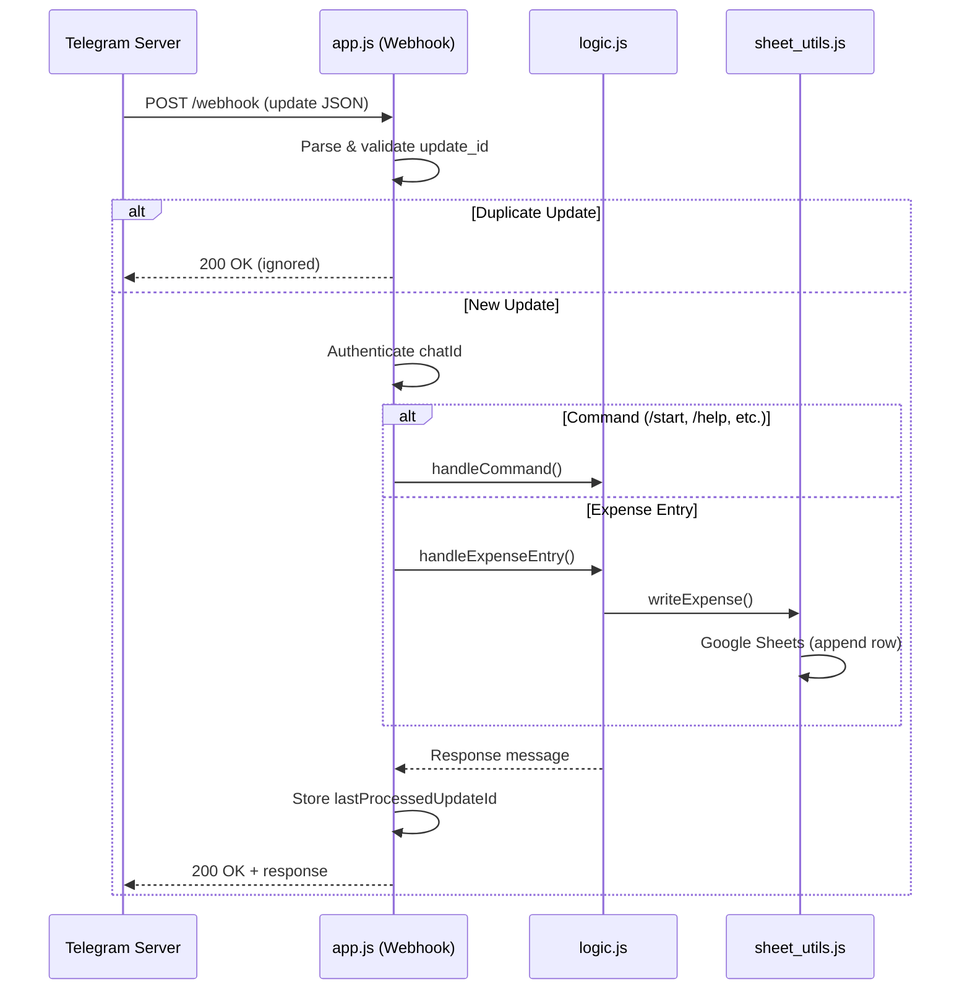
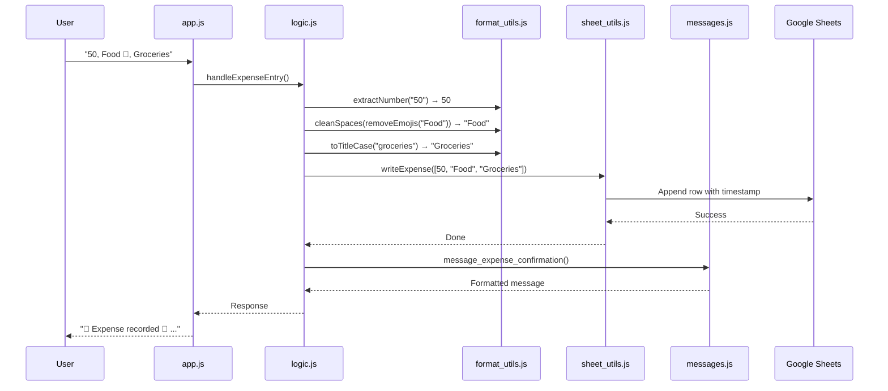
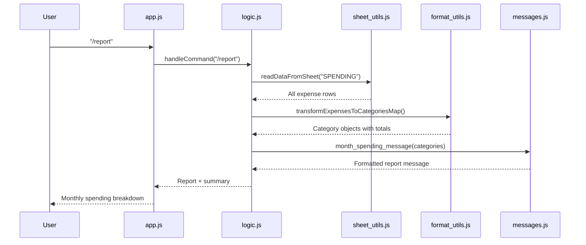
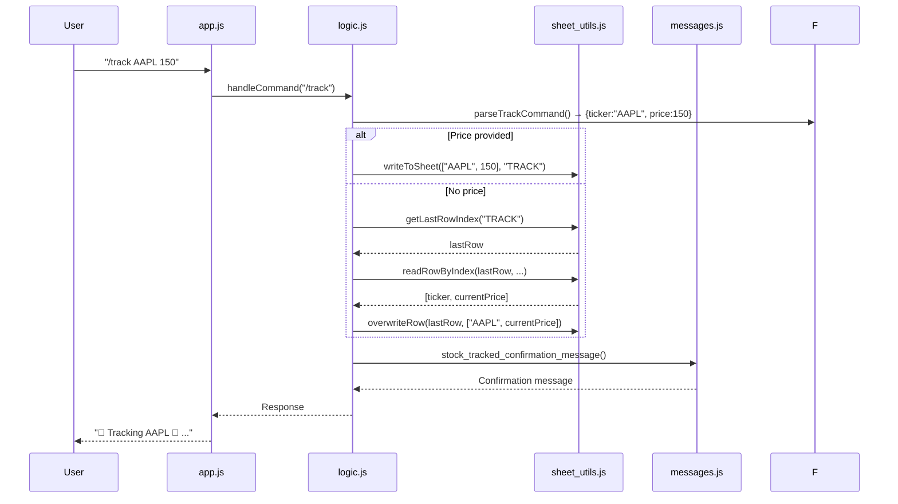
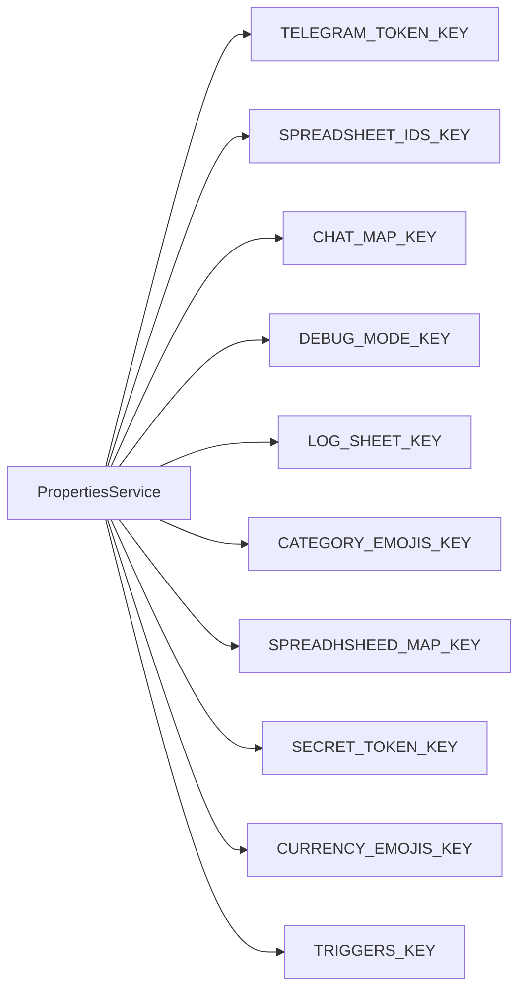

# Expense Tracker Bot - Architecture & Documentation

## Overview

This is a Telegram bot built with **Google Apps Script** that helps users track expenses, monitor stocks and currencies, and generate monthly spending reports. The bot uses Google Sheets as its backend database and communicates with Telegram via webhooks.

---

## System Architecture

---

## File Roles

### 1. **app.js** — Webhook Entry Point
The main entry point for all incoming Telegram updates via webhook POST requests.

**Responsibilities:**
- Parses incoming JSON payloads from Telegram
- Validates and extracts `update_id` to prevent duplicate processing
- Authenticates the user's chat ID
- Routes updates to either command handler (`handleCommand`) or expense entry handler (`handleExpenseEntry`)
- Stores the last processed `update_id` to avoid reprocessing

**Key Function:** `doPost(e)`

---

### 2. **logic.js** — Business Logic Core
Contains all command handling and expense entry parsing logic.

**Responsibilities:**
- Routes commands to appropriate handlers (`/start`, `/cats`, `/stocks`, `/track`, `/report`)
- Parses expense entries in format: `amount, category, subcategory (optional), description (optional)`
- Handles stock tracking with the `/track` command
- Generates monthly spending reports

**Key Functions:**
| Function | Purpose |
|----------|---------|
| `handleUpdate(update, chatId)` | Entry point for processing any update |
| `handleExpenseEntry(text, chatId)` | Parses and logs expense entries |
| `handleCommand(command, chatId)` | Routes and executes bot commands |

---

### 3. **messages.js** — Message Templates
Generates all user-facing messages with consistent formatting and emojis.

**Responsibilities:**
- Formats expense confirmation messages
- Generates monthly spending summaries with category breakdowns
- Creates help, start, and categories list messages
- Formats stock summary messages with HTML/Markdown

**Key Functions:**
| Function | Output |
|----------|--------|
| `message_expense_confirmation()` | Expense logged confirmation |
| `month_spending_message()` | Monthly spending report by category |
| `help_command_message()` | Available commands list |
| `categories_list_message()` | Category/subcategory reference |
| `stock_summary_message()` | Stock & currency dashboard |
| `start_command_message()` | Welcome message |

---

### 4. **sheet_utils.js** — Google Sheets Integration
All read/write operations to Google Spreadsheets.

**Responsibilities:**
- Writes rows to sheets (with optional timestamps)
- Reads data from specific ranges and cells
- Handles protected sheet ranges for expense entries
- Provides utility functions for row/column indexing

**Key Functions:**
| Function | Purpose |
|----------|---------|
| `writeToSheet(row, sheetName)` | Appends a row to any sheet |
| `writeExpense(row, sheetName)` | Writes expense with timestamp (handles protected ranges) |
| `readDataFromSheet(sheetName)` | Reads all data from a sheet |
| `readRowByIndex(...)` | Reads a specific row range |
| `overwriteRow(rowIndex, row, sheetName)` | Overwrites an existing row |
| `getLastRowIndex(sheetName)` | Gets the last used row number |

---

### 5. **telegram_utils.js** — Telegram API Wrapper
Handles communication with the Telegram Bot API.

**Responsibilities:**
- Sends messages to users via `sendMessage`
- Authenticates user chat IDs against allowed users
- Returns proper HTTP responses for webhooks

**Key Functions:**
| Function | Purpose |
|----------|---------|
| `sendMessage(chatId, message)` | Posts a message to Telegram with optional parse mode |
| `authenticate(chatId)` | Validates if the chat ID is authorized |
| `respondOk(message)` | Returns 200 OK response for webhooks |

---

### 6. **constants.js** — Configuration & Environment
Centralized configuration stored in Google Apps Script PropertiesService.

**Responsibilities:**
- Loads all environment variables from script properties
- Defines sheet name mappings
- Stores category emojis, currency emojis, and trigger flags
- Provides global constants for the application

**Key Constants:**
| Constant | Source | Purpose |
|----------|--------|---------|
| `TELEGRAM_TOKEN` | Properties | Bot authentication token |
| `SPREADSHEET_ID_MAP` | Properties | Maps sheet aliases to spreadsheet IDs |
| `CHAT_TO_USER` | Properties | Maps chat IDs to user aliases |
| `CATEGORY_EMOJIS_MAP` | Properties | Category-to-emoji mappings |
| `CURRENCY_EMOJIS_MAP` | Properties | Currency-to-emoji mappings |
| `TRIGGERS_MAP` | Properties | Enables/disables scheduled triggers |

---

### 7. **format_utils.js** — Data Transformation Utilities
Helper functions for parsing, cleaning, and transforming data.

**Responsibilities:**
- Extracts numbers from strings (for expense amounts)
- Cleans and normalizes text (removes emojis, fixes spacing)
- Transforms flat expense arrays into hierarchical category structures
- Parses `/track` command arguments

**Key Functions:**
| Function | Purpose |
|----------|---------|
| `extractNumber(str)` | Extracts first number from a string |
| `cleanSpaces(str)` | Normalizes whitespace |
| `removeEmojis(str)` | Strips emojis from text |
| `toTitleCase(str)` | Converts string to title case |
| `mapCategoriesToSubcategories(data)` | Builds category→subcategory map from sheet data |
| `transformExpensesToCategoriesMap(expenses)` | Creates hierarchical Category objects from expense rows |
| `parseTrackCommand(message)` | Parses `/track TICKER PRICE` commands |

---

### 8. **classes.js** — Data Models
Object-oriented classes for representing domain entities.

**Responsibilities:**
- Defines structured data types for Currency, Stock, and Category
- Provides formatting and display methods

**Classes:**

#### `Currency`
Represents a currency with its value, name, and emoji.

| Property | Type | Description |
|----------|------|-------------|
| `value` | number | Numeric value |
| `name` | string | Currency name (e.g., "USD") |
| `emoji` | string | Display emoji (e.g., "💵") |
| `display_str` | string | Formatted display string |

#### `Stock`
Represents a tracked stock with percentage change.

| Property/Method | Type | Description |
|-----------------|------|-------------|
| `stock_name` | string | Ticker symbol (e.g., "AAPL") |
| `plus_minus_percent` | number | Percentage change |
| `thresholds` | object | Low/warning/high thresholds |
| `getDirectionIcon()` | string | 🟢/🔴/⚪ based on % change |
| `getStatusIcon()` | string | 🟡/🔴 based on thresholds |
| `toDisplayLine()` | string | Formatted display line for summary |

#### `Category`
Represents an expense category with optional subcategories.

| Property/Method | Type | Description |
|-----------------|------|-------------|
| `name` | string | Category name |
| `emoji` | string/null | Display emoji |
| `total_spent` | number | Accumulated spending |
| `_subcategories` | Map | Internal subcategory storage |
| `addAmount(amount)` | void | Adds to total_spent |
| `getOrCreateSubcategory(name)` | Category | Gets or creates a subcategory |

---

### 9. **triggers.js** — Scheduled Tasks
Handles time-based automated tasks via Google Apps Script triggers.

**Responsibilities:**
- Sends daily pre-market stock summaries on weekdays (Mon-Fri)
- Fetches current stock/currency data from spreadsheets
- Formats and sends HTML-formatted messages to users

**Key Functions:**
| Function | Purpose |
|----------|---------|
| `daily()` | Trigger function called by scheduled trigger |
| `send_daily_stock_summary_message(chatId, title)` | Fetches data and sends stock/currency dashboard |

---

### 10. **debug.js** — Debugging Utilities
Currently minimal/empty. Reserved for additional debugging helpers.

---

## Data Flow Diagrams

### Expense Entry Flow

### Command Flow (/report)

### Stock Tracking Flow (/track)

---

## Google Sheets Structure

The bot uses multiple sheets across potentially two spreadsheets (edit and read-only):

| Sheet Alias | Actual Name | Purpose | Columns |
|-------------|-------------|---------|---------|
| `EXPENSES` | EXPENSES | All logged expenses | Timestamp, Amount, Category, Subcategory, Description |
| `MONTHLY` | MONTHLY EXPENSES | Monthly summary data | Total spent, Top category, Top subcategory, etc. |
| `CATEGORIES` | CATEGORIES | Category/subcategory reference | Categories in row 1, subcategories below |
| `SPENDING` | SPENDING | Historical spending for reports | Month, Category, Subcategory, Amount |
| `TRACK` | TRACK | Tracked stocks | Ticker, Reference Price, Current Price, % Change |
| `CURRENCIES` | CURRENCIES | Tracked currencies | Currency Name, Symbol, Value, % Change |
| `LOG` | LOG (configurable) | Debug log entries | Message text |

---

## Configuration Setup

All configuration is stored in **Google Apps Script PropertiesService**:

## Deployment Notes
- **Google Apps Script Project**: All .js files are part of a single Google Apps Script project
- **Webhook Setup**: Deploy app.js:doPost as a web app with execute-as-me and access-anyone settings
- **Scheduled Triggers**: Set up a time-driven trigger for daily() in triggers.js (weekdays only)
- **Telegram Bot**: Create a bot via @BotFather and store the token in script properties
- **Spreadsheet Setup**: Create sheets as documented above and configure IDs in properties