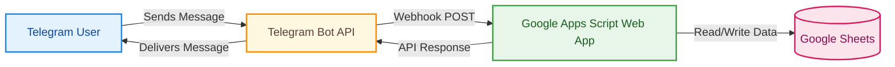
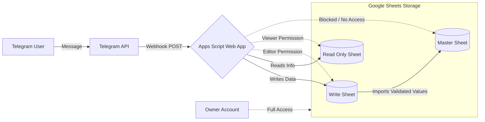

# ExpenseTracker Bot

A Telegram bot built with Google Apps Script for tracking daily expenses and monitoring stocks, with all data stored in Google Sheets.

## Table of Contents

- [Features](#features)
- [Architecture](#architecture)
- [Prerequisites](#prerequisites)
- [Setup Instructions](#setup-instructions)
  - [Step 1: Set Up Google Sheets](#step-1-set-up-google-sheets)
  - [Step 2: Create a Telegram Bot](#step-2-create-a-telegram-bot)
  - [Step 3: Configure Google Apps Script](#step-3-configure-google-apps-script)
  - [Step 4: Set Environment Variables](#step-4-set-environment-variables)
  - [Step 5: Deploy as Web App](#step-5-deploy-as-web-app)
  - [Step 6: Set Telegram Webhook](#step-6-set-telegram-webhook)
  - [Step 7: Configure Time-Driven Trigger (Optional)](#step-7-configure-time-driven-trigger-optional)
- [Environment Variables Reference](#environment-variables-reference)
- [Usage](#usage)
  - [Logging an Expense](#logging-an-expense)
  - [Bot Commands](#bot-commands)
- [Project Structure](#project-structure)
- [Security Notes](#security-notes)
- [Troubleshooting](#troubleshooting)

## Features

- Log expenses via Telegram with automatic categorization and subcategories
- Assign emojis to categories dynamically by including them in expense entries
- Monthly spending reports broken down by category and subcategory
- Stock tracking by ticker symbol with reference prices
- Daily pre-market stock and currency summaries (Optional; weekday trigger)
- User authentication restricted to authorized Telegram chat IDs
- Optional debug mode for troubleshooting

## Architecture



1. A user sends a message to the Telegram bot.
2. Telegram forwards the update as a POST request to your Google Apps Script Web App URL (webhook).
3. The `doPost(e)` function in `app.js` receives and parses the payload.
4. The request is authenticated, routed to either command handling or expense logging.
5. Data is read from or written to Google Sheets as needed.
6. A response message is sent back to the user via the Telegram API.

- **Note**: While the code is cleanly separated into files, Google App Scripts will end up merging everything into a single file, hence why you don't see any imports.

## Prerequisites

- A **Google account** with access to Google Sheets and Apps Script
- A **Telegram account**
- Basic familiarity with curl commands (for webhook setup)

## Setup Instructions

### Step 1: Set Up Google Sheets

Create a new Google Spreadsheet with the following tabs (sheets):

| Tab Name          | Purpose                                                | Columns (Row 1 = Headers)                                                                                                   |
| ----------------- | ------------------------------------------------------ | --------------------------------------------------------------------------------------------------------------------------- |
| `EXPENSES`        | Stores all expense entries                             | `Timestamp`, `Amount`, `Category`, `Subcategory`, `Description`                                                             |
| `MONTHLY EXPENSES` | Monthly spending summary                               | Row 2, columns C through G: `Total Spent`, `Top Category`, `Top Category Total`, `Top Subcategory`, `Top Subcategory Total` |
| `CATEGORIES`      | Auto-generated category and subcategory list           | Column headers are categories; subsequent rows contain subcategories                                                        |
| `SPENDING`        | Aggregated spending data for reports                   | `Month`, `Category`, `Subcategory`, `Amount`                                                                                |
| `TRACK`           | Stock tracking data                                    | `Ticker`, `Price`, (additional columns populated by API)                                                                    |
| `CURRENCIES`      | Currency exchange rates                                | Columns include currency name and value                                                                                     |
| `LOGS`            | Debug logs (optional, used when debug mode is enabled) | Single column for log messages                                                                                              |

**Important:** Note down the **Spreadsheet ID** from the URL. It is the long string between `/d/` and `/edit`:

```
https://docs.google.com/spreadsheets/d/YOUR_SPREADSHEET_ID/edit
```

You can also create a separate read-only copy of the spreadsheet for report queries:

```
https://docs.google.com/spreadsheets/d/YOUR_SPREADSHEET_ID/copy
```

### Step 2: Create a Telegram Bot

1. Open Telegram and search for **BotFather** (or go to https://t.me/BotFather).
2. Send `/newbot`.
3. Follow the prompts to choose a name and username for your bot.
4. BotFather will provide you with a **bot token**. Save this token securely -- you will need it later.

Optional: Set up menu button commands by running this curl command (replace `<YOUR_BOT_TOKEN>`):

```bash
curl -X POST "https://api.telegram.org/bot<YOUR_BOT_TOKEN>/setMyCommands" \
  -H "Content-Type: application/json" \
  -d '{
    "commands": [
      { "command": "report", "description": "Get the current month spending log" },
      { "command": "cats", "description": "List all logged categories" },
      { "command": "stocks", "description": "Summary of tracked stocks" },
      { "command": "track <ticker> [price]", "description": "Track a stock by ticker symbol" },
      { "command": "help", "description": "Show available commands" }
    ]
  }'
```

### Step 3: Configure Google Apps Script

#### Option A: Manual Setup

1. Go to https://script.google.com and create a new project.
2. For each `.js` file in this repository, create a corresponding `.gs` file in the Apps Script editor and paste its contents:

| Source File         | Apps Script File    | Purpose                                  |
| ------------------- | ------------------- | ---------------------------------------- |
| `app.js`            | `app.gs`            | Webhook entry point (`doPost`)           |
| `constants.js`      | `constants.gs`      | Environment variables and constants      |
| `logic.js`          | `logic.gs`          | Core business logic (commands, expenses) |
| `messages.js`       | `messages.gs`       | Telegram message formatters              |
| `telegram_utils.js` | `telegram_utils.gs` | Telegram API helpers and authentication  |
| `sheet_utils.js`    | `sheet_utils.gs`    | Google Sheets read/write operations      |
| `format_utils.js`   | `format_utils.gs`   | String/number formatting utilities       |
| `triggers.js`       | `triggers.gs`       | Time-driven trigger handlers             |
| `classes.js`        | `classes.gs`        | Data classes (Stock, Currency, Category) |

#### Option B: Using CLASP (Command Line Apps Script Projects)

CLASP allows you to manage Apps Script projects from the command line. See the official documentation at https://developers.google.com/apps-script/guides/clasp.

```bash
# Install CLASP globally
npm i -g @google/clasp

# Authenticate
clasp login

# Create a new project
clasp create --type appscript

# Push local files to the project
clasp push

# Deploy
clasp deploy
```

### Step 4: Set Environment Variables

In the Apps Script editor, go to **Project Settings** (gear icon) and scroll down to **Script Properties**. Add the following key-value pairs:

| Key                    | Value Format               | Description                                                                                              | Example                                                                                                               |
| ---------------------- | -------------------------- | -------------------------------------------------------------------------------------------------------- | --------------------------------------------------------------------------------------------------------------------- |
| `telegramToken`        | String                     | Your Telegram bot token from BotFather                                                                   | `123456789:ABCdefGHIjklMNOpqrSTUvwxYZ`                                                                                |
| `spreadsheetIds`       | JSON object                | Map of spreadsheet IDs. Use `edit_sheet` for write operations and `read_only_sheet` for read-only access | `{"edit_sheet":"1aBcDeFgHiJkLmNoPqRsTuVwXyZ","read_only_sheet":"1xYzAbCdEfGhIjKlMnOpQrStUvW"}`                        |
| `chatMap`              | JSON object                | Maps Telegram chat IDs to user aliases. Only listed users can use the bot                                | `{"1234567890":"Alice","9876543210":"Bob"}`                                                                           |
| `secretToken`          | String                     | A secret token appended to the webhook URL for request validation                                        | `mySecretToken123`                                                                                                    |
| `categoryEmojis`       | JSON object                | Maps category names to emojis (auto-updated when you include emojis in expense entries)                  | `{"Food":"\ud83c\udf57","Transport":"\ud83d\ude87","Travel":"\u2708\ufe0f"}`                                          |
| `currencyEmojis`       | JSON object                | Maps currency names to emojis                                                                            | `{"Dollar":"\ud83d\udcb5","Euro":"\ud83d\udcb6"}`                                                                     |
| `debugMode`            | String ("true" or "false") | Enables debug logging to the LOGS sheet                                                                  | `"false"`                                                                                                             |
| `logSheetName`         | String                     | Name of the sheet tab for debug logs                                                                     | `LOGS`                                                                                                                |
| `readSpreadsheetNames` | JSON object                | Maps aliases to actual sheet tab names                                                                   | `{"EXPENSES":"EXPENSES","MONTHLY":"MONTHLY SUMMARY","CATEGORIES":"CATEGORIES","SPENDING":"SPENDING","TRACK":"TRACK"}` |
| `triggers`             | JSON object                | Toggles for time-driven triggers                                                                         | `{"daily_stock_summary":true}`                                                                                        |

> If you rename a sheet tab in Google Sheets, you must update the corresponding value in readSpreadsheetNames. The bot does not auto detect renamed tabs.

**Alternative** (not recommended): You can set these properties programmatically by adding and running this function once in your Apps Script project:

```javascript
function setupProperties() {
  const props = PropertiesService.getScriptProperties();
  props.setProperties({
    telegramToken: "YOUR_TELEGRAM_BOT_TOKEN",
    spreadsheetIds: JSON.stringify({ edit_sheet: "YOUR_SHEET_ID" }),
    chatMap: JSON.stringify({ 1234567890: "YourName" }),
    secretToken: "YOUR_SECRET_TOKEN",
    categoryEmojis: JSON.stringify({
      Food: "\ud83c\udf57",
      Transport: "\ud83d\ude87",
    }),
    currencyEmojis: JSON.stringify({ Dollar: "\ud83d\udcb5" }),
    debugMode: "false",
    logSheetName: "LOGS",
    readSpreadsheetNames: JSON.stringify({
      EXPENSES: "EXPENSES",
      MONTHLY: "MONTHLY SUMMARY",
      CATEGORIES: "CATEGORIES",
      SPENDING: "SPENDING",
      TRACK: "TRACK",
    }),
    triggers: JSON.stringify({ daily_stock_summary: true }),
  });
}
```

**To find your Telegram chat ID:** Send a message to your bot, then visit `https://api.telegram.org/bot<YOUR_BOT_TOKEN>/getUpdates` in your browser. Look for the `"chat":{"id":1234567890}` field in the JSON response.

### Step 5: Deploy as Web App

1. In the Apps Script editor, click **Deploy** > **New deployment**.
2. Click the gear icon next to "Select type" and choose **Web app**.
3. Configure the following settings:
   - **Description:** `ExpenseTracker Bot` (or any label you prefer)
   - **Execute as:** `Me` (your Google account email)
   - **Who has access:** `Anyone`
4. Click **Deploy**.
5. When prompted, authorize the script to access your Google Sheets and send Telegram API requests. Review and accept the permissions.
6. Copy the **Web app URL** -- it will look like:

```
https://script.google.com/macros/s/YOUR_DEPLOYMENT_ID/exec
```

You will need this URL in the next step.

> **Important:** After making code changes, you must create a new deployment version for the updates to take effect. Go to **Deploy** > **Manage deployments**, select your deployment, click the pencil icon, increment the version number, and save.

### Step 6: Set Telegram Webhook

The webhook tells Telegram where to send incoming messages. Append your secret token as a query parameter to your Web App URL.

Run this command in your terminal (replace placeholders with your actual values):

```bash
curl -X POST "https://api.telegram.org/bot<YOUR_BOT_TOKEN>/setWebhook" \
  -H "Content-Type: application/json" \
  -d '{
    "url": "https://script.google.com/macros/s/YOUR_DEPLOYMENT_ID/exec?token=<YOUR_SECRET_TOKEN>"
  }'
```

Example with real values:

```bash
curl -X POST "https://api.telegram.org/bot123456789:ABCdefGHIjklMNOpqrSTUvwxYZ/setWebhook" \
  -H "Content-Type: application/json" \
  -d '{
    "url": "https://script.google.com/macros/s/ABCDEFGHIJKLMNOPQRSTUVWXY/exec?token=mySecretToken123"
  }'
```

**Verify the webhook was set correctly:**

```bash
curl "https://api.telegram.org/bot<YOUR_BOT_TOKEN>/getWebhookInfo"
```

The response should show `"url"` matching your Web App URL and `"has_custom_certificate": false`.

**To delete the webhook (if needed):**

```bash
curl "https://api.telegram.org/bot<YOUR_BOT_TOKEN>/deleteWebhook"
```

### Step 7: Configure Time-Driven Trigger (Optional)

The bot supports a daily stock summary that runs on weekdays. To enable it:

1. In the Apps Script editor, click **Triggers** (clock icon in the left sidebar).
2. Click **+ Add Trigger**.
3. Configure:
   - **Choose which function to run:** `daily`
   - **Deployment:** `Head`
   - **Event source:** `Time-driven`
   - **Type of time based trigger:** `Day timer`
   - **Select time from day:** Choose your preferred hour (e.g., 8:00 AM -- 9:00 AM for pre-market)
4. Click **Save** and authorize if prompted.

The daily summary will be sent to the first user listed in the `chatMap` property.

## Environment Variables Reference

All environment variables are stored as Google Apps Script **Script Properties**, accessible via `PropertiesService.getScriptProperties()`.

| Variable               | Required              | Type                                                | Description                                   |
| ---------------------- | --------------------- | --------------------------------------------------- | --------------------------------------------- |
| `telegramToken`        | Yes                   | String                                              | Bot token provided by BotFather               |
| `spreadsheetIds`       | Yes                   | JSON (`{"edit_sheet":"id","read_only_sheet":"id"}`) | Spreadsheet IDs for write and read operations |
| `chatMap`              | Yes                   | JSON (`{"chatId":"alias"}`)                         | Authorized users mapped to display names      |
| `secretToken`          | Recommended           | String                                              | Token appended to webhook URL for validation  |
| `categoryEmojis`       | No                    | JSON (`{"CategoryName":"emoji"}`)                   | Category-to-emoji mapping (auto-populated)    |
| `currencyEmojis`       | No                    | JSON (`{"CurrencyName":"emoji"}`)                   | Currency-to-emoji mapping                     |
| `debugMode`            | No                    | String (`"true"` or `"false"`)                      | Enables debug logging to LOGS sheet           |
| `logSheetName`         | No (if debug enabled) | String                                              | Name of the debug log sheet tab               |
| `readSpreadsheetNames` | Yes                   | JSON                                                | Maps aliases to actual sheet tab names        |
| `triggers`             | No                    | JSON (`{"daily_stock_summary":true/false}`)         | Toggle for time-driven triggers               |

### Advanced Security Architecture (Recommended)

For maximum security and data privacy, I recommend implementing a **Three-Sheet / Two-Account** architecture. This setup isolates sensitive financial data from the bot's execution environment and mitigates risks like formula injection attacks.

The following diagram illustrates the separation of concerns between the Bot Account (execution) and the Master Account (ownership), as well as the flow of validated data.



#### 1. The Three-Sheet System

- **Write Sheet (Bot Input)**:
  - This is the only sheet where the bot has write permissions. It receives raw expense entries and stock tickers directly from Telegram.
  - **Formula Injection Protection**: This sheet includes a boolean validation column that detects if any cell in a row contains a formula. The Master Sheet is configured to import data from this source _only_ if it consists of plain values, effectively neutralizing malicious formulas injected via user messages.

- **Master Sheet (Sensitive Data)**:
  - Contains your private financial details: budgets, income, detailed graphs, and aggregated reports.
  - This sheet imports clean, validated data from the Write Sheet but is never directly written to by the bot. It remains completely isolated from external API calls.

- **Read-Only Sheet (Exposed Data)**:
  - Contains only non-sensitive information that the bot needs to read for reporting, such as category lists or summary totals.
  - The bot reads exclusively from this sheet, ensuring it never accesses the Master Sheet's sensitive data during normal operation.

#### 2. The Two-Account System

- **Master Account (Owner)**:
  - Owns all three sheets and manages sharing permissions.
  - Has full access to view and edit everything, including the sensitive Master Sheet.

- **Bot Account (Service Account)**:
  - Runs the Google Apps Script project.
  - **Restricted Permissions**:
    - **Editor** access only on the **Write Sheet**.
    - **Viewer/Reader** access only on the **Read-Only Sheet**.
    - **No Access** to the **Master Sheet**.

#### Security Benefits

- **Data Isolation**: Even if the bot's code or token is compromised, an attacker cannot view your Master Sheet (budgets, income) because the Bot Account has no permission to see it.
- **Formula Injection Prevention**: By validating that imported data contains no formulas before bringing it into the Master Sheet, you prevent malicious users from injecting scripts via Telegram messages that could exfiltrate private data.
- **Least Privilege Principle**: The bot operates with the minimum permissions necessary to function, delegating security enforcement to Google's native permission model rather than relying solely on code-level checks.

## Usage

### Logging an Expense

Send a message to your bot in the following format:

```
<amount>, <category> [emoji (optional)], <subcategory (optional)>, <description (optional)>
```

Examples:

```
50, Food, Groceries, Green apples
25.50, Transport, Uber, Commute to work
100, Travel
```

Including an emoji with a category (e.g., `Food 🍽`) will automatically assign that emoji to the category for future reports.

### Bot Commands

| Command                   | Description                                                                              |
| ------------------------- | ---------------------------------------------------------------------------------------- |
| `/start`                  | Welcome message with bot introduction                                                    |
| `/report`                 | Current month spending log and summary                                                   |
| `/cats`                   | List all tracked categories and subcategories                                            |
| `/stocks`                 | Real-time stock brief for tracked tickers                                                |
| `/track <TICKER> [PRICE]` | Track a stock by ticker symbol. Price is optional; if omitted, it is fetched from an API |
| `/help`                   | Show available commands                                                                  |

## Project Structure

```
app.js            -- Webhook entry point (doPost function)
constants.js      -- Environment variable keys and parsed values
logic.js          -- Core routing: command handling vs expense logging
messages.js       -- Telegram message formatting functions
telegram_utils.js -- Telegram API helpers and user authentication
sheet_utils.js    -- Google Sheets read/write operations
format_utils.js   -- String parsing, number extraction, currency formatting
triggers.js       -- Time-driven trigger handlers (daily stock summary)
classes.js        -- Data model classes: Stock, Currency, Category
debug.js          -- Debug utility functions
```

## Security Notes

1. **User Authentication:** Only chat IDs listed in the `chatMap` property are authorized to use the bot. All other requests are rejected.

2. **Secret Token Validation:** The webhook URL includes a `token` query parameter. The `authenticate()` function validates this token on each incoming request, ensuring the request originated from your configured endpoint.

3. **Duplicate Update Prevention:** The bot stores the last processed Telegram `update_id` in script properties. Duplicate or replayed updates are silently ignored to prevent double-logging.

4. **Separate Read/Write Sheets:** Use different spreadsheet IDs for `edit_sheet` and `read_only_sheet` to limit write access. Share only the read-only copy with others.

5. **Debug Mode:** Keep `debugMode` set to `"false"` in production. Debug mode logs all incoming requests to the LOGS sheet, which may contain sensitive information.

## Troubleshooting

| Issue                                   | Solution                                                                                                                                                                    |
| --------------------------------------- | --------------------------------------------------------------------------------------------------------------------------------------------------------------------------- |
| Bot does not respond to messages        | Check webhook status with `curl https://api.telegram.org/bot<TOKEN>/getWebhookInfo`. Verify the URL is correct and accessible.                                              |
| "Unauthorized telegram user" error      | Ensure your Telegram chat ID is listed in the `chatMap` script property.                                                                                                    |
| Expenses are not being saved to Sheets  | Verify that `spreadsheetIds.edit_sheet` contains the correct spreadsheet ID and that sheet tab names match those in `readSpreadsheetNames`.                                 |
| Webhook setup fails or returns an error | Ensure the Web App deployment has "Who has access" set to **Anyone**. Google Apps Script web apps must be publicly accessible for Telegram to reach them.                   |
| Code changes are not taking effect      | Create a new deployment version after each code change (Deploy > Manage deployments > Edit > increment version).                                                            |
| Debug logs are not appearing            | Set `debugMode` to `"true"` in script properties and ensure the LOGS sheet tab exists.                                                                                      |
| Daily stock summary is not sent         | Verify that the time-driven trigger is configured (Triggers sidebar) and that `triggers.daily_stock_summary` is set to `true`. The trigger only runs Monday through Friday. |

## Additional Resources

- [Telegram Bot API Documentation](https://core.telegram.org/bots/api)
- [Google Apps Script Documentation](https://developers.google.com/apps-script/reference)
- [CLASP (Command Line Apps Script Projects)](https://developers.google.com/apps-script/guides/clasp)
- [BotFather on Telegram](https://t.me/BotFather)

⚠️ Google Apps Script webhooks must respond within 6 minutes. Heavy sheet operations (e.g., large /report queries) should be optimized or offloaded to avoid timeout errors.

This project is provided as-is for personal use. Feel free to modify and extend it to fit your needs.
